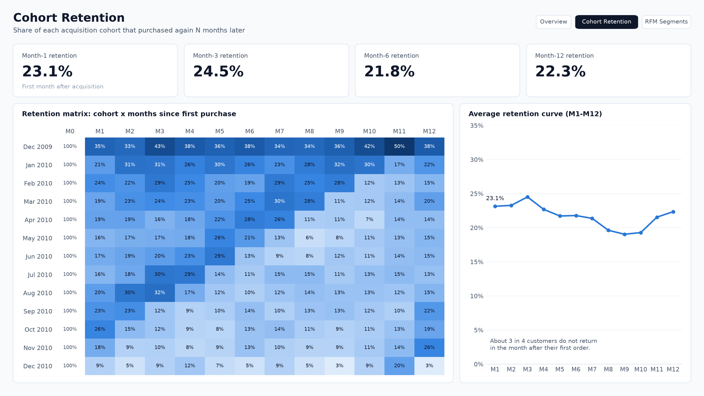
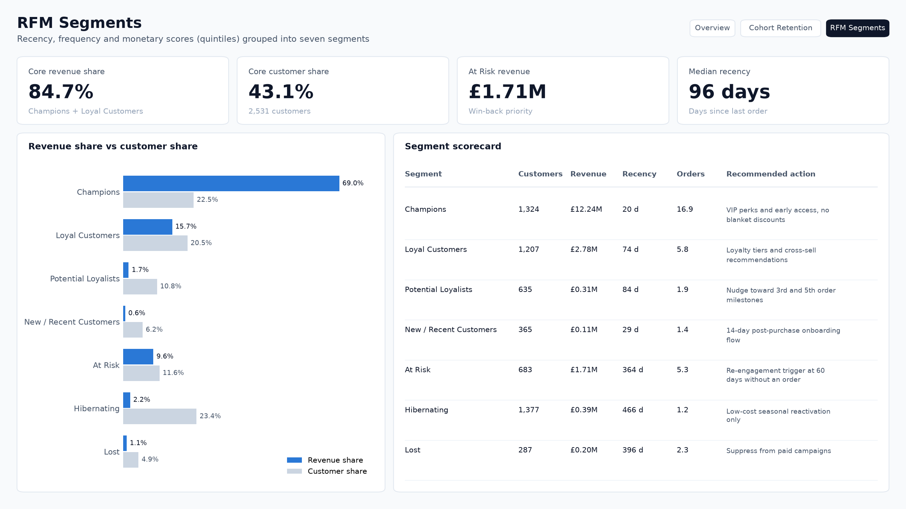

# E-Commerce Customer Segmentation & Cohort Retention


Cohort retention and RFM segmentation of 5,878 customers of a UK-based online retailer (Dec 2009 – Dec 2011), turned into a retention playbook and a Power BI dashboard.


## Business question

Acquisition costs are rising while marketing still relies on blanket discounts. Leadership wants to know **where customers drop off** and **which customers are worth investing in**, so budget can move from mass promotions to targeted retention.

## Key results

| Metric | Value |
| :--- | ---: |
| Cleaned transaction lines | 805,549 (from 1.06M raw) |
| Revenue analysed | £17.74M |
| Customers / countries | 5,878 / 41 |
| Average order value | £480 |
| Month-1 retention (customer-weighted) | 23.1% |
| Champions + Loyal Customers | 43.1% of customers, 84.7% of revenue |

1. **The first month is the cliff.** Only 23.1% of new customers buy again in the month after their first order. Retention then holds at roughly 19–25% through month 12, so the biggest lever is the second purchase.
2. **Revenue is highly concentrated.** Champions are 22.5% of customers but 69.0% of revenue. Hibernating and Lost customers are 28.3% of the base and only 3.3% of revenue.
3. **£1.71M sits in At Risk customers** (683 customers, last order about a year ago on average) – the clearest win-back target.
4. **Strong Q4 seasonality.** Monthly revenue peaks in November in both years at around £1.2M.

## Dashboard

Three pages in Power BI: Overview, Cohort Retention and RFM Segments. Data model, DAX measures, theme and build guide are in [`powerbi/`](powerbi/README.md).

| Cohort Retention | RFM Segments |
| :---: | :---: |
|  |  |

## Analysis

### Cohort retention


### RFM segmentation
Customers are scored 1–5 on recency, frequency and monetary value (quintiles) and grouped into seven segments.

| Segment | Customers | % customers | Revenue | % revenue | Avg recency (days) | Avg orders | Avg spend |
| :--- | ---: | ---: | ---: | ---: | ---: | ---: | ---: |
| Champions | 1,324 | 22.5% | £12,242,058 | 69.0% | 20 | 16.9 | £9,246 |
| Loyal Customers | 1,207 | 20.5% | £2,778,210 | 15.7% | 74 | 5.8 | £2,302 |
| At Risk | 683 | 11.6% | £1,708,453 | 9.6% | 364 | 5.3 | £2,501 |
| Hibernating | 1,377 | 23.4% | £394,013 | 2.2% | 466 | 1.2 | £286 |
| Potential Loyalists | 635 | 10.8% | £309,190 | 1.7% | 84 | 1.9 | £487 |
| Lost | 287 | 4.9% | £198,631 | 1.1% | 396 | 2.3 | £692 |
| New / Recent Customers | 365 | 6.2% | £112,874 | 0.6% | 29 | 1.4 | £309 |


### Monthly revenue


## Recommendations

| Owner | Action |
| :--- | :--- |
| Marketing | Move part of the acquisition budget into lifecycle automation for New and At Risk customers. Replace blanket discounts with targeted win-back offers; reward Champions with access and perks, not margin. |
| CRM | Send a personalised 14-day post-purchase flow to close the month-0 → month-1 gap. Trigger re-engagement when a customer passes 60 days without an order, well before the At Risk threshold. |
| Product | Introduce loyalty tiers with milestones at the 3rd and 5th order to move Potential Loyalists up. |

## Repository structure

```
├── data/              cleaned sample transactions, segmented customers
├── docs/              project brief
├── metrics/           cohort counts, retention rates, segment summary
├── powerbi/           Power BI model tables, DAX, theme, build guide, previews
├── presentations/     executive slide deck (.pptx)
├── reports/           executive report (.pdf)
├── sql/               schema, cohort and RFM queries (SQLite)
├── src/               ETL, charts, Power BI model and preview scripts
├── tableau/           Tableau data source
└── visualizations/    charts used in this README
```

## Reproduce

```bash
pip install -r requirements.txt

# 1. Full pipeline: needs online_retail_II.xlsx (UCI) in data/
python src/etl_pipeline.py

# 2. Charts
python src/generate_minimalist_visualizations.py

# 3. Power BI tables and page previews
python src/build_powerbi_model.py
python src/render_dashboard_preview.py
```

Dataset: [Online Retail II, UCI Machine Learning Repository](https://archive.ics.uci.edu/dataset/502/online+retail+ii). The raw file and the SQLite database are not committed because of their size; `data/cleaned_transactions_sample100k.csv` holds the first 100k cleaned lines for inspection.
