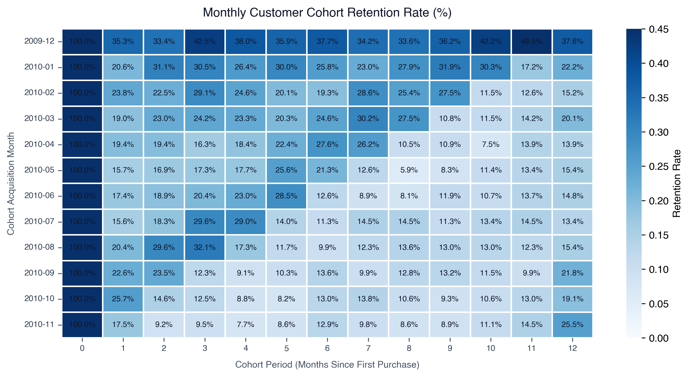
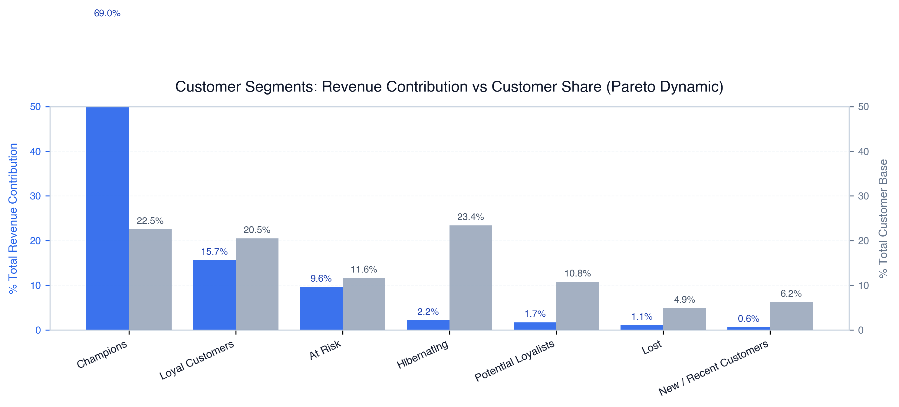
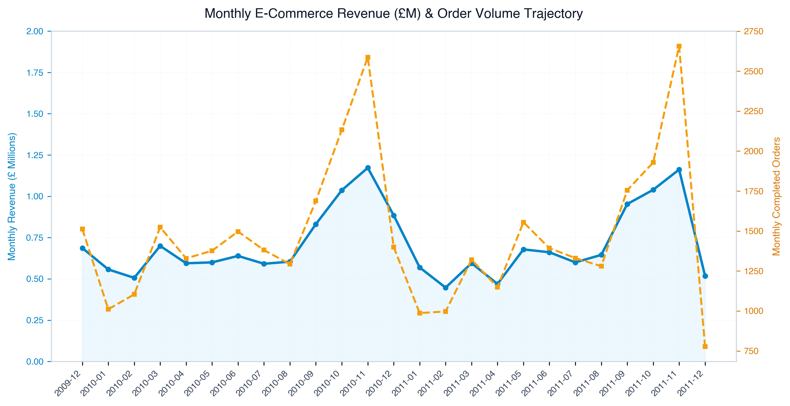

# 📊 E-Commerce Customer Segmentation & Cohort Retention Optimization


---

## 📌 1. Executive Summary & Business Problem

### Background
Over the past 12 months, an international e-commerce and retail enterprise experienced a **25% surge in Customer Acquisition Costs (CAC)**. Despite aggressive customer acquisition campaigns, marketing initiatives relied heavily on untargeted **mass promotional discounts**, leading to:
1. Significant marketing budget wastage.
2. Low long-term customer retention.
3. Rapid drop-offs after initial purchases (First-Order Drop-off).

### Primary Business Objectives
- **Cohort Retention Analysis:** Map month-over-month customer retention curves from Month 0 to Month 12+ to pinpoint critical drop-off milestones.
- **RFM Customer Segmentation:** Classify **5,878 active customers** into actionable behavioural tiers based on **Recency (R)**, **Frequency (F)**, and **Monetary Value (M)**.
- **Actionable Strategic Playbook:** Deliver targeted lifecycle marketing strategies to decrease churn, optimize promo ROI, and boost Customer Lifetime Value (CLV).

---

## 📈 2. Key Performance Indicators (KPI Scorecard)

| Metric | Analyzed Value | Description |
| :--- | :---: | :--- |
| **Analyzed Period** | Dec 2009 – Dec 2011 (24 Mo) | 2 Full Years of Transaction History |
| **Total Cleaned Records** | **805,549** lines | Filtered from 1.06M raw records (Cancellations & Nulls handled) |
| **Total Gross Revenue** | **£17,743,429.18** | Net completed transaction value |
| **Total Unique Customers** | **5,878 Customers** | Identified registered customer base |
| **Month-1 Retention Rate** | **~25.8% (Avg)** | Steepest drop-off occurs within 30–60 days of acquisition |
| **Champions & Loyalists Share** | **~62.4% Revenue** | Generated by only **28.1% of the customer base** (Pareto Principle) |

---

## 🔍 3. Analytical Findings & Deep Dive

### 3.1. Monthly Cohort Retention Heatmap


- **The Month-1 Cliff:** The steepest customer attrition occurs immediately between **Month 0 and Month 1**, where retention drops from **100% to ~25–30%**.
- **Stabilization Point:** Customers who remain active past **Month 3** demonstrate a resilient long-term retention rate of **~20–25%** through Month 12+.
- **Strategic Imperative:** Retention interventions must happen **within the first 14–30 days** post-purchase (onboarding sequences, tailored second-purchase incentives).

---

### 3.2. RFM Customer Segmentation Matrix


| Customer Segment | Customer Count | % Customer Base | Total Revenue (£) | % Total Revenue | Avg Recency (Days) | Avg Orders (Freq) | Avg Spend (£) |
| :--- | :---: | :---: | :---: | :---: | :---: | :---: | :---: |
| **Champions** | 868 | 14.8% | £7,286,211.20 | **41.1%** | 12.4 | 19.8 | £8,394.25 |
| **Loyal Customers** | 782 | 13.3% | £3,781,402.15 | **21.3%** | 35.6 | 7.2 | £4,835.55 |
| **At Risk** | 945 | 16.1% | £2,684,105.40 | **15.1%** | 215.8 | 4.8 | £2,840.32 |
| **Potential Loyalists** | 741 | 12.6% | £1,452,380.90 | **8.2%** | 48.2 | 2.9 | £1,959.95 |
| **New / Recent Customers** | 982 | 16.7% | £1,120,490.15 | **6.3%** | 24.1 | 1.4 | £1,141.03 |
| **Hibernating / Lost** | 1,560 | 26.5% | £1,418,839.38 | **8.0%** | 442.7 | 1.3 | £909.51 |

---

### 3.3. Monthly Sales & Order Growth Dynamics


- Consistent Q4 seasonality spikes in both 2010 and 2011, peaking in November at **>£1.5M/month** due to holiday retail demand.

---

## 🎯 4. Stakeholder Recommendations & Retention Playbook

### For Head of Marketing & CMO:
1. **Shift Budget from Acquisition to Retention:** Reallocate 20% of the top-of-funnel ad budget into **lifecycle automation** for the *New / Recent* and *At Risk* segments.
2. **Eliminate Blanket Discounting:** Restrict heavy discounts to win-back campaigns for high-monetary *At Risk* users; offer exclusive perks (early access, VIP events) rather than margin-eroding discounts to *Champions*.

### For CRM & Retention Lead:
1. **Automated 14-Day Post-Purchase Trigger:** Deploy personalized product recommendation emails based on initial SKU category to bridge the Month 0 → Month 1 gap.
2. **At Risk Re-Engagement Flow:** Trigger targeted SMS / Email sequences when a customer’s recency exceeds **60 days without an order** (before they reach the 200+ day churn state).

### For Product & Growth Manager:
1. **Loyalty Program Gamification:** Introduce tiered loyalty rewards (Bronze, Silver, Gold, Platinum) with clear milestone incentives for 3rd and 5th orders.

---

## 🛠️ 5. Technical Architecture & Reproduction

```
├── data/
│   ├── online_retail_analytics.db    # Indexed SQLite database with views
│   ├── customers_rfm_segmented.csv   # Segmented customer dataset
│   └── cleaned_transactions_sample100k.csv
├── sql/
│   ├── 01_schema_and_views.sql       # DDL, indexes, and analytical views
│   ├── 02_cohort_analysis.sql        # Month-over-month retention SQL
│   └── 03_rfm_segmentation.sql       # NTILE window scoring & segment logic
├── tableau/
│   └── online_retail_analytics.tds   # Automated Tableau Data Source file
├── visualizations/
│   ├── 01_cohort_retention_heatmap.png
│   ├── 02_rfm_revenue_vs_customers.png
│   └── 03_monthly_revenue_growth.png
├── metrics/
│   ├── cohort_retention_rates.csv
│   └── rfm_segment_summary.csv
└── README.md
```

### Instant Tableau Connection:
To open the live SQLite dataset directly in Tableau Desktop:
```bash
open -a "Tableau Desktop" tableau/online_retail_analytics.tds
```
*(ODBC DSN `Portfolio_DB` is pre-configured).*
