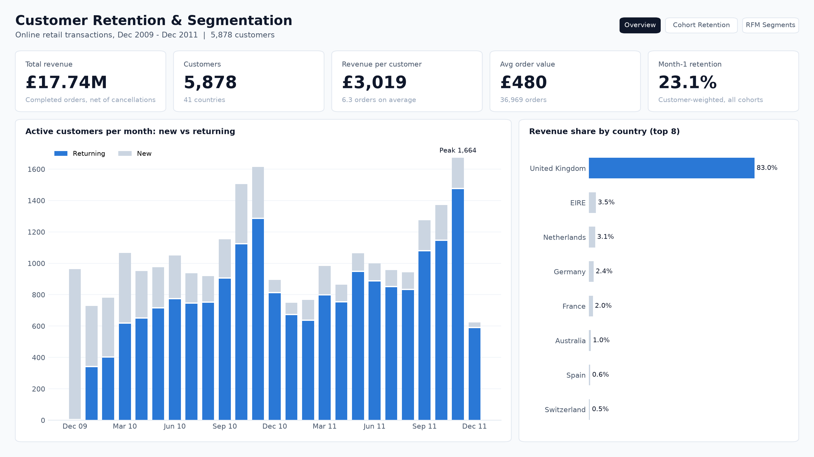

# Power BI Dashboard

A three-page report built on a small star schema. Everything needed to rebuild it lives in this folder; only the final `.pbix` is created in Power BI Desktop (Windows).

| Page | Question it answers |
| :--- | :--- |
| Overview | How big is the business, and how many customers come back each month? |
| Cohort Retention | What share of each acquisition cohort buys again N months later? |
| RFM Segments | Which segments drive revenue, and what should we do with each? |



## Folder contents

```
powerbi/
├── data/
│   ├── dim_customer.csv     5,878 customers with RFM scores and segment
│   ├── dim_segment.csv      7 segments: sort order, group, recommended action
│   └── fact_cohort.csv      325 cohort x month rows (active customers, cohort size)
├── theme/
│   └── minimal_light.json   report theme (colours, fonts, card style)
├── measures.dax             every DAX measure used in the report
├── power_query.m            Power Query scripts for the three tables
└── preview/                 page previews rendered from the same data
```

The CSVs are generated by `python src/build_powerbi_model.py` from `data/customers_rfm_segmented.csv` and `metrics/cohort_user_counts.csv`.

## Data model

```
dim_segment (1) ──── (*) dim_customer          fact_cohort (standalone)
   segment                 segment                 cohort_month, month_index,
   segment_order           customer_id, country    activity_month, cohort_size,
   segment_group           recency_days, frequency active_customers, retention_rate
   recommended_action      monetary_value, r/f/m
```

- Relationship: `dim_segment[segment]` 1 → * `dim_customer[segment]`, single direction.
- `fact_cohort` is aggregated (one row per cohort and month offset), so it has no customer key and needs no relationship.

## Build steps (about 45 minutes)

**1. Load data**
1. Open Power BI Desktop → *Blank report*.
2. *Home → Get data → Text/CSV* and load the three files in `powerbi/data/`. Or use `power_query.m`: create a text parameter `DataFolder` pointing to the folder, then paste each query into *Blank Query → Advanced Editor*.
3. In *Transform data*, check types: dates for `cohort_month` and `activity_month`, currency for `monetary_value`, whole numbers for counts.

**2. Model**
1. *Model view*: drag `dim_segment[segment]` onto `dim_customer[segment]` (one-to-many, single).
2. `dim_segment[segment]` → *Column tools → Sort by column* → `segment_order`.
3. Hide the technical columns in report view: `r_score`, `f_score`, `m_score`, `rfm_score`, `segment_order`.

**3. Measures**
1. *Home → Enter data* → create an empty table named `_Measures`.
2. Add each measure from `measures.dax` (*New measure*, paste, set the format noted in the comment).
3. Delete the placeholder column so `_Measures` moves to the top of the field list.

**4. Theme and canvas**
1. *View → Themes → Browse for themes* → `theme/minimal_light.json`.
2. *Format page → Canvas settings*: 16:9, 1280 × 720.

**5. Pages** (positions in px: x, y, width, height)

*Page 1: Overview*

| Visual | Fields | Position |
| :--- | :--- | :--- |
| Text box: title + subtitle | "Customer Retention & Segmentation" | 24, 16, 700, 56 |
| 5 × Card (new) | Total Revenue, Customers, Revenue per Customer, Avg Order Value, Month 1 Retention | y = 80, h = 96, w = 236, 12 px gap |
| Stacked column chart | X: `fact_cohort[activity_month]` (month), Y: Returning Customers, New Customers | 24, 188, 780, 508 |
| Clustered bar chart | Y: `dim_customer[country]`, X: Revenue Share %, Top N = 8 by Total Revenue | 816, 188, 440, 508 |

*Page 2: Cohort Retention*

| Visual | Fields | Position |
| :--- | :--- | :--- |
| 4 × Card | Month 1 / 3 / 6 / 12 Retention | y = 80, h = 96, w = 299 |
| Matrix | Rows: `cohort_month` (month), Columns: `month_index`, Values: Retention Rate. Filter `month_index` ≤ 12. Conditional formatting → background colour → gradient `#EEF5FD` → `#0D366B` | 24, 188, 800, 508 |
| Line chart | X: `month_index` (1-12, *Don't summarize*), Y: Retention Rate | 836, 188, 420, 508 |

*Page 3: RFM Segments*

| Visual | Fields | Position |
| :--- | :--- | :--- |
| 4 × Card | Core Revenue Share %, Core Customer Share %, Total Revenue (filter segment = At Risk), Avg Recency (Days) | y = 80, h = 96, w = 299 |
| Clustered bar chart | Y: `dim_segment[segment]`, X: Revenue Share %, Customer Share % | 24, 188, 520, 508 |
| Table | segment, Customers, Total Revenue, Avg Recency (Days), Avg Orders per Customer, recommended_action | 556, 188, 700, 508 |

**6. Navigation and finish**
1. Add three buttons top right (*Insert → Buttons → Blank*, action *Page navigation*) labelled Overview, Cohort Retention, RFM Segments.
2. Optional slicer on Pages 1 and 3: `dim_customer[country]` as a dropdown.
3. Keep colour minimal: blue `#2A78D6` for the measure that matters, grey `#CBD5E1` for comparison.
4. Save as `powerbi/ecommerce_customer_retention.pbix`, take a screenshot of each page and replace the files in `preview/`.

## Check your numbers

| Measure | Expected |
| :--- | ---: |
| Total Revenue | £17,743,429 |
| Customers | 5,878 |
| Orders | 36,969 |
| Avg Order Value | £480 |
| Month 1 Retention | 23.1% |
| Core Revenue Share % | 84.7% |
| Core Customer Share % | 43.1% |
